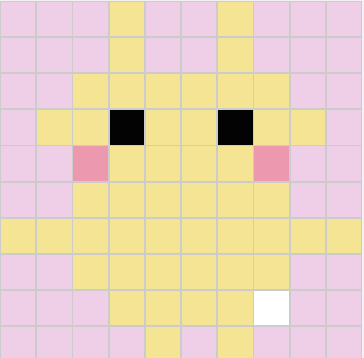
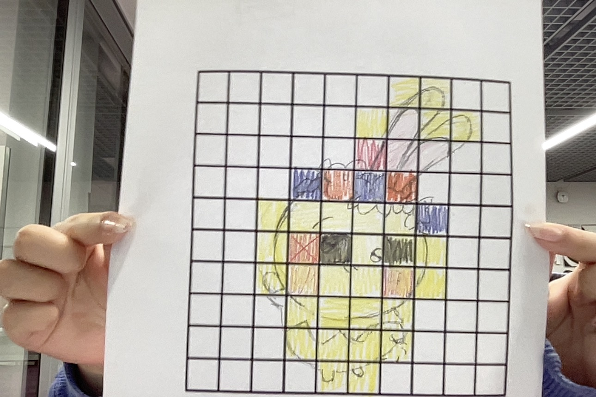

# Using Hexadecimal to make images

Pixalated image of Usagi

## Image

A

## Code 

### Hexadecimal

0A
0A
18
f5ceea f5ceea f5ceea f7e388 f5ceea f5ceea f7e388 f5ceea f5ceea f5ceea 
f5ceea f5ceea f5ceea f7e388 f5ceea f5ceea f7e388 f5ceea f5ceea f5ceea 
f5ceea f5ceea f7e388 f7e388 f7e388 f7e388 f7e388 f7e388 f5ceea f5ceea 
f5ceea f7e388 f7e388 030303 f7e388 f7e388 030303 f7e388 f7e388 f5ceea 
f5ceea f5ceea fa93af f7e388 f7e388 f7e388 f7e388 fa93af f5ceea f5ceea
f5ceea f5ceea f7e388 f7e388 f7e388 f7e388 f7e388 f7e388 f5ceea f5ceea 
f7e388 f7e388 f7e388 f7e388 f7e388 f7e388 f7e388 f7e388 f7e388 f7e388
f5ceea f5ceea f7e388 f7e388 f7e388 f7e388 f7e388 f7e388 f5ceea f5ceea
f5ceea f5ceea f5ceea f7e388 f7e388 f7e388 f7e388 ffffff f5ceea f5ceea
f5ceea f5ceea f5ceea f5ceea f7e388 f5ceea f7e388 f5ceea f5ceea f5ceea

### Binary

0000 1010
0000 1010
0001 1000
111101011100111011101010 111101011100111011101010 111101011100111011101010 111101011100111011101010 111101111110001110001000 111101011100111011101010 111101011100111011101010 111101111110001110001000 111101011100111011101010 111101011100111011101010 
111101011100111011101010 111101011100111011101010 111101011100111011101010 111101011100111011101010 111101111110001110001000 111101011100111011101010 111101011100111011101010 111101111110001110001000 111101011100111011101010 111101011100111011101010 
111101011100111011101010 111101011100111011101010 111101011100111011101010 111101111110001110001000 111101111110001110001000 111101111110001110001000 111101111110001110001000 111101111110001110001000 111101111110001110001000 111101011100111011101010 
111101011100111011101010 111101011100111011101010 111101111110001110001000 111101111110001110001000 000000110000001100000011 111101111110001110001000 111101111110001110001000 000000110000001100000011 111101111110001110001000 111101111110001110001000 
111101011100111011101010 111101011100111011101010 111101011100111011101010 111110101001001110101111 111101111110001110001000 111101111110001110001000 111101111110001110001000 111101111110001110001000 111110101001001110101111 111101011100111011101010 
111101011100111011101010 111101011100111011101010 111101011100111011101010 111101111110001110001000 111101111110001110001000 111101111110001110001000 111101111110001110001000 111101111110001110001000 111101111110001110001000 111101011100111011101010 
111101011100111011101010 111101111110001110001000 111101111110001110001000 111101111110001110001000 111101111110001110001000 111101111110001110001000 111101111110001110001000 111101111110001110001000 111101111110001110001000 111101111110001110001000 
111101111110001110001000 111101011100111011101010 111101011100111011101010 111101111110001110001000 111101111110001110001000 111101111110001110001000 111101111110001110001000 111101111110001110001000 111101111110001110001000 111101011100111011101010 
111101011100111011101010 111101011100111011101010 111101011100111011101010 111101011100111011101010 111101111110001110001000 111101111110001110001000 111101111110001110001000 111101111110001110001000 111111111111111111111111 111101011100111011101010 
111101011100111011101010 111101011100111011101010 111101011100111011101010 111101011100111011101010 111101011100111011101010 111101111110001110001000 111101011100111011101010 111101111110001110001000 111101011100111011101010 111101011100111011101010 
111101011100111011101010 
