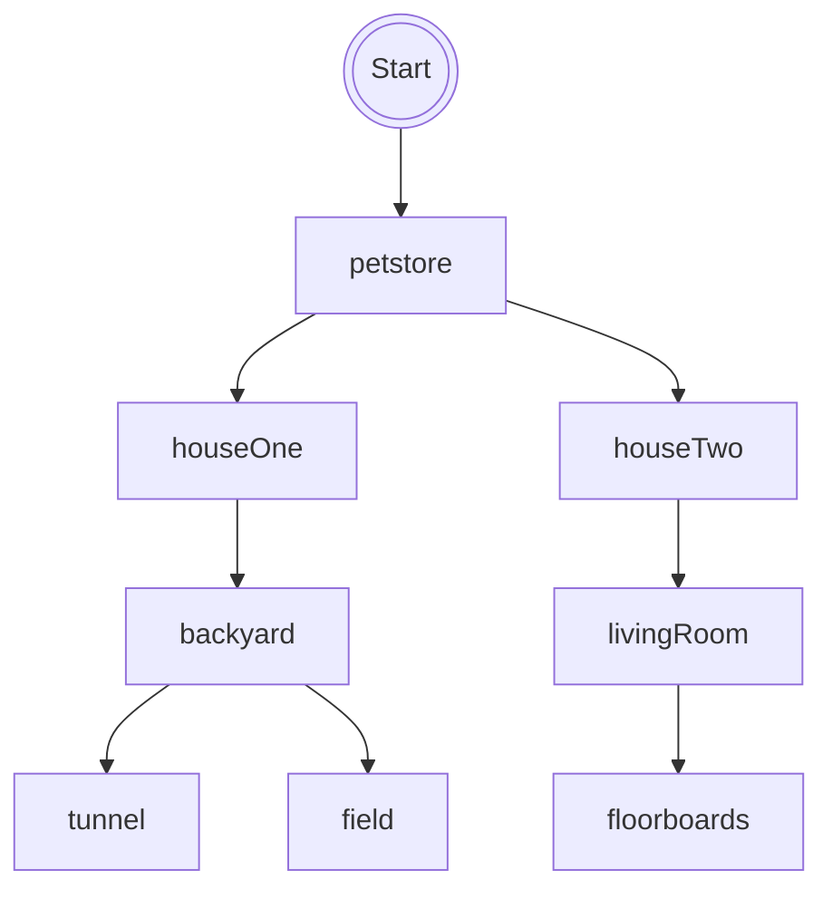

# Life Of A Hamster

## Setting

This game is about your life as a hamster and your journey to freedom. 
There are two houses each with their own obstacles, you must avoid to escape.
## Map

The player starts by being born as a hamster. They are moved to a pet store, where their journey starts. 
They can pick from 2 houses to live in, if player chooses to remain in pet store they die.

## Story

The player has the choice to pick either of the 2 houses or remain in the pet store.

In the first house you will be given the choice to escape or remain in your cage.  If you stay in your cage you live out your life and die a natural death. If you go outside you either dig a tunnel or run across the field. If you dig a tunnel you are now free. If you run in the open a hawk swoops down and eats you.

In the second house you can either escape or remain. Once you escape you enter the living room, where the owner keeps their dog. You can either choose to hide under the floorboards or stay in place. If you stay the dog eats you. If you hide you are now free.
