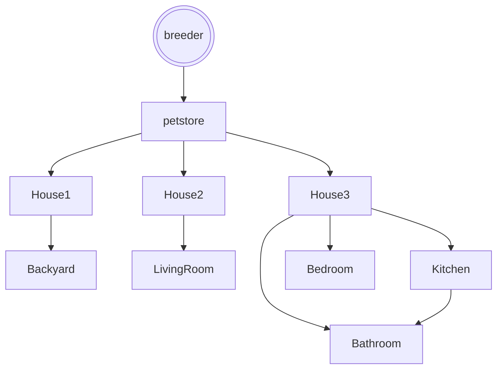

# Life Of A Hamster

## Setting

This game is loosely based off of my hamster and her possible life if she had different owners.

## Map

The player starts by being born as a hamster to a reputable breeder. They are moved to a pet store, where they're life officially starts. 
They can pick one of the 3 houses to live in, if player chooses to remain in pet store they die.

## Story

The player has the choice to either wake up and be seen by one of the 3 owners or can remain asleep, leaving the person to pick a different hamster.

In the first house you will be given the choice to escape or remain in your cage. Then you can choose whether or not to go ouside. If you remain inside you will be found and put back in your cage. You will get the same option again. If you stay in your cage you live out your life and die a natural death. If you go outside you either dig a tunnel or run across the field. If you dig a tunnel you are now free. If you run in the open a hawk swoops down and eats you.

In the second house you can either escape or remain. Once you escape you enter the living room, where your owner keeps their dog. Your choice is to go back under the door where you're safe from the dog or go into the living room. If you go back your owner puts you back and you live there happily safe from the dog. If you go into the living room, you must hide from the dog. If you hide under the couch you can eventually escape once the dog falls asleep.If you run the dog catches and eats you.

In the third home you either escape or remain. Once you escape you can either go to the bedroom, kitchen or bathroom. If you go to the bedroom you are caught and returned to your cage. If you go to the kitchen there are food scraps you can eat. You can either hide under the fridge or under the oven. The oven turns on and you get cooked. The fridge is safe and you avoid being found and survive off of the leftovers. If you go to the bathroom, you can either hide under the cabinent or in the trash can. If you hide under the cabinent you are never found and freeze to death. If you hide in the trashcan theyour owners find you in the morning and you are saved from the cold and go back home. The kitchen has the option to go to the bathroom.

## Global Variables

The most important variables are
`haveCup` and `cupIsFull`, both
booleans that track progress in the
story. Depending on these two variables,
some rooms will display different things. For example, if you walk into the
library without the cup, it will prompt you to
read. If you walk in with the cup, it will show
the librarian filling the cup with coffee.

I also have numeric variables called `day` and `minute` which keep track of 
time. `minute` starts at 0 and counts up
with each move.

I have a little HUD map, and use a bunch of 
boolean variables to control which
rooms the player has discovered. A map is only displayed after the user
visits it.
